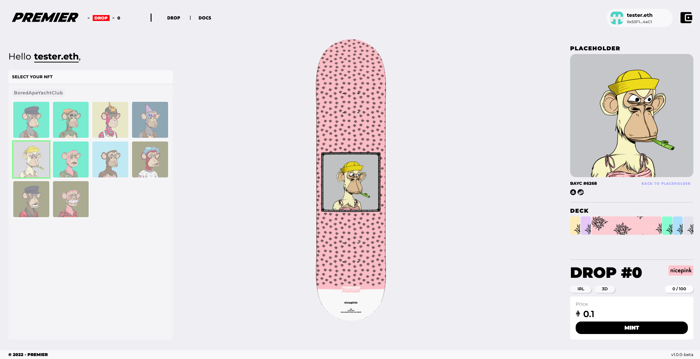

# PREMIER

> Premier is a side project I started after working for a year at Bancor.

The project is currently live on:

**Goerli**:

`Store.sol`: [0x8ae7E7B2a1c96A3FACbd916d7EE2BCF3ddF586d0](https://goerli.etherscan.io/address/0x8ae7e7b2a1c96a3facbd916d7ee2bcf3ddf586d0)

`Drop#0.sol`: [0xd3b610ecD4f903599AfCd33De9473154662cc053](https://goerli.etherscan.io/address/0xd3b610ecD4f903599AfCd33De9473154662cc053)

Drop 0 IPFS entrypoint: [QmciaLdP3NwPa9PinfoEqHndz72FjNTPckGCDrb5C2LmQp](https://ipfs.io/ipfs/QmciaLdP3NwPa9PinfoEqHndz72FjNTPckGCDrb5C2LmQp)

## Try It

If you want to see some minted item, you can check those out:

[Drop 0 / Drip 0](https://sshtest.netlify.app/app/drop/0/0)

[Drop 0 / Drip 1](https://sshtest.netlify.app/app/drop/0/1)

[Drop 0 / Drip 2](https://sshtest.netlify.app/app/drop/0/2)

[Drop 0 / Drip 3](https://sshtest.netlify.app/app/drop/0/3)

Or, if you want to test the project, I'd suggest you to [get some GoerliETH](https://goerlifaucet.com/), then [mint some already-existing-on-other-chain NFT](https://www.testnetmint.com/). You'll then be able to see your NFT through the app and you'll be able to mutate a minted board with your just minted NFT.

If you don't have any NFT you can still mint a board, you just won't be able to mutate it - until you get an NFT to mutate it with, of course.

## DevOps

The app is hosted on Netlify.

The server is hosted on a free Amazon EC2 instance.

The IPFS files are being pinned and managed by Pinata.

## Architecture

The project is splitted into 4 packages:

- **Typings**
- **Contracts**
- **Server**
- **App**

### Typings

Stack: [ **Typescript** ]

The typing package is a fully independent package that contains all the basic typings and informations that needs to be shared accross the whole project.

### Contracts

> Project Dependencies: [ Typings ]

Stack: [ **Typecript**, **Hardhat**, **Ethers**, **IPFS** ]

The contract package contains everything related to **smart-contracts**. It includes smart-contracts, **deployment scripts** but also additionals scripts for the deployment of metadata to **IPFS**. On top of that, by taking advantages of the **typechain** package, typescript bindings are generated for our smart-contracts and can be used anywhere.

### Server

> Dependencies: [ Typings, Contracts ]

Stack: [ **Typecript**, **Express**, **Websocket** ]

At the root of the backend ecosystem the server handles what the frontend needs in order to work properly. It make uses of **Websocket** to improve connectivity and reactivness.

**Env file exemple:**

```
SERVER__NODE_ENV=development
SERVER__CHAIN_ID=1337

SERVER__PORT=4000

SERVER__CORS_ORIGIN=http://localhost:3000
SERVER__WEB3_ENDPOINT=http://127.0.0.1:8545
SERVER__IPFS_ENDPOINT=http://127.0.0.1:8080

SERVER__OPENSEA_API_KEY=
```

### App

> Dependencies: [ Typings, Contracts ]

Stack: [ **Typescript**, **React**, **Vite**, **RTK Query**, **React Three Fiber** (Three.js) ]

Made in **React** it leverages **RTK Query** to improve caching and code management. The 3D is handled by **React Three Fiber**, a 3D library built on top of Three.js, it was quite a challenge at first as I've never worked with 3D before. I migrated the app from CRA to Vite.

**Env file exemple:**

```
FAST_REFRESH=false

VITE__PORT=3000
VITE__NODE_ENV=development
VITE__SERVER_URL=http://localhost:4000
VITE__WEBSOCKET_SERVER_URL=ws://localhost:4000
VITE__BLOCKEXPLORER=https://goerli.etherscan.io
VITE__OPENSEA_URL=https://testnets.opensea.io/assets/goerli
```
